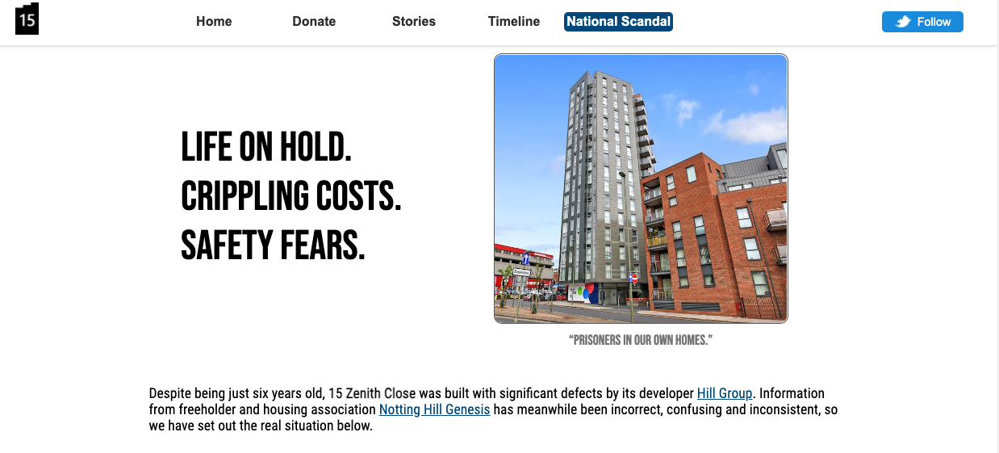
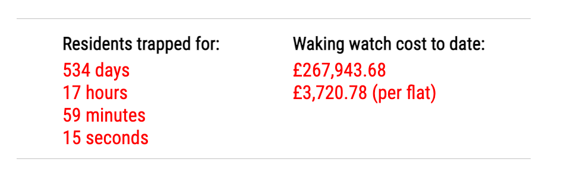
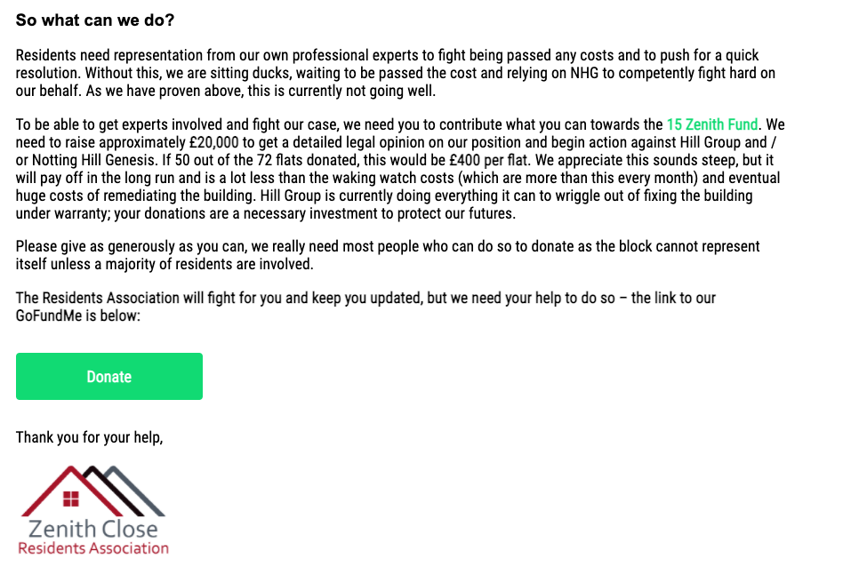
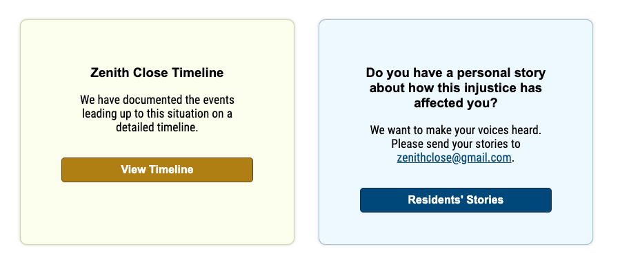
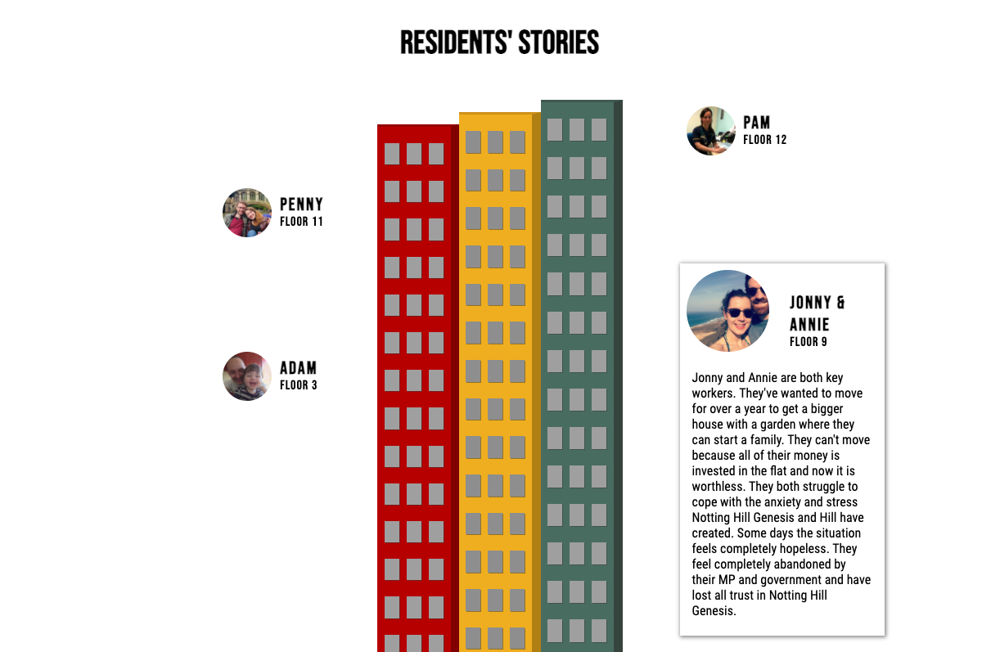
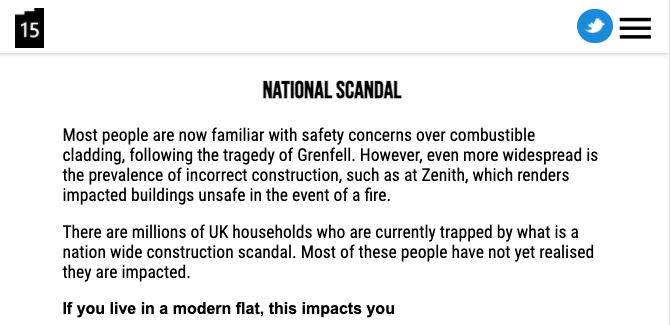

# 15 Zenith Close

Informational website to shed light on the cladding scandal at Zenith Close. This story has since been picked up by LBC, BBC Panorama, Daily Mail, and Property Week. It has also been brought to the attention of MP Matthew Offord and Councilor Anne Clark, who have elevated the matter to Barnet Council and Parliament.

This website is no longer being maintained. For the latest updates on these issues, please see our page on [Twitter](https://twitter.com/zenithclose).

### Developed by:
* Penny Jungreis - [GitHub](https://github.com/penelopecj)

## Deployment
I deployed this website using Netlify and it is available [_here_](https://15zenith.co.uk/). 

## Technologies Used
  * JavaScript (ES6)
  * HTML5
  * CSS3
  * VS Code
  * Git + GitHub
  * Netlify

## Description
Despite being just six years old, 15 Zenith Close was built with significant defects by its developer Hill Group. Information from freeholder and housing association Notting Hill Genesis has meanwhile been incorrect, confusing, and inconsistent, so this website sets out the real facts of the situation for residents and journalists.

**Homepage**

Details all of the most important information.

**Day & Costs Counter**

A live counter updates every second to show the days residents have been unable to sell their flats and the accumulating costs of having a waking watch in the building.

**Fundraiser**

Information about fundraising with a link to a GoFundMe page.

**Redirects to Other Pages**

**Resident Stories**

An interactive page displaying a tower built with CSS. Visitors can click on the photos to read stories about the residents trapped in the building.

**Mobile-Responsive Design**

The nav bar will switch to display a small Twitter bubble and mobile menu on smaller screens.

